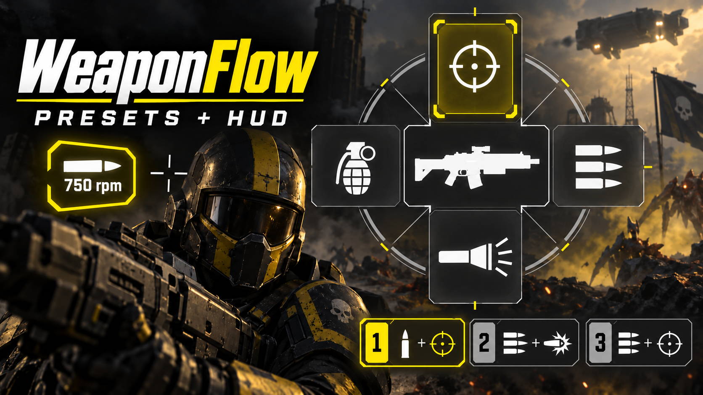

# WeaponFlow



**Your weapon settings when you equip. One button to switch them in combat.**

A Helldivers 2 mod with up to three saved presets per weapon and a customizable
mode indicator. Preset 1 restores your defaults whenever you equip a weapon.
Switch to another preset while aiming in first or third person, or even firing.

- Save fire modes, ammo, RPM, scope distance and other available settings.
- Use one preset-switch button instead of separate buttons for each setting.
- Apply your presets to every copy of a weapon, including another player's.
- Show a chosen setting as an icon, text or both, or hide it for that weapon.
- Keep one shared flashlight preference across weapons.
- Share presets through the clipboard; use any of the 14 game text languages.

## Quick start

Import a built WeaponFlow ZIP into HD2 Arsenal and enable **WeaponFlow** with
**[Bingus Shared Loader v17](https://github.com/CowboyBingus/BingusSharedLoader/releases/tag/v17)**
and **[Mod Bindings Menu v2.1](https://www.nexusmods.com/helldivers2/mods/16478)**.

**R means your weapon-menu button.** Use your actual binding if you changed it;
wait for the weapon menu to open and keep holding the button.

| Action | Default controls |
| --- | --- |
| Save a preset | Hold **R**, tap **P**, then press **1**, **2** or **3** |
| Clear all presets for this weapon | Hold **R**, double-tap **P** |
| Switch presets | Assign **Swap presets** in **Options → Mouse & Keyboard → MODS → WeaponFlow**; press it without R |
| Choose a setting for the indicator | Hold **R**, tap **H** to open help; further H presses change the setting |
| Move the indicator | **Arrow keys** while HUD help is open and R is held |
| Choose icon / text / both | **F10** while HUD help is open |

Preset 1 is your default on equip. Manual changes stay until the next real equip
or preset switch; stims and grenade throws preserve them. Starter presets are
included and can be replaced or cleared.

**Full instructions:** [English](release/README.md) · [Русский](release/README-RU.md)

## Build from source

Requires Python 3.10+ and a separate checkout of Bingus Shared Loader with
`scripts/build_addon.py` and `scripts/archive.py`.

```powershell
python build_weapon_modes_release.py --bsl-source 'C:\path\to\BingusSharedLoader' --flavor release
```

The main archive is written to `dist/`. Use `--flavor both` to also build the
separate diagnostics companion. Existing versioned archives are preserved.
See [build instructions](release/BUILD.md) for details.

## Source layout

- `src/` — runtime Lua, native readers, presets, controls, HUD and embedded assets.
- `src/locales/` — translations and [localization guide](src/locales/README.md).
- `tests/` — regression checks with isolated game-data fixtures.
- `release/` — player documentation, changelog, asset notices and font licenses.
- `build_weapon_modes_release.py` — Arsenal package builder.
- `generate_network_field_aliases.py` — offline Stingray field-hash helper.

For development checks:

```powershell
python -m pip install -r requirements-dev.txt
python tests/run_checks.py controls
```

Choose `controls`, `presets`, `hud` or `packaging` for the changed area.
See [test notes](tests/README.md).

## Credits

CowboyBingus — Bingus Shared Loader and Mod Bindings Menu.
DDRK1NG — HUD rendering inspiration. Filediver — resource extraction.
Liberation Fonts and Noto — HUD fonts.

Game icons and strings belong to the Helldivers 2 rights holders.
[Third-party notices](release/THIRD-PARTY-NOTICES.md) and both font licenses
are included in this repository and the mod package.
